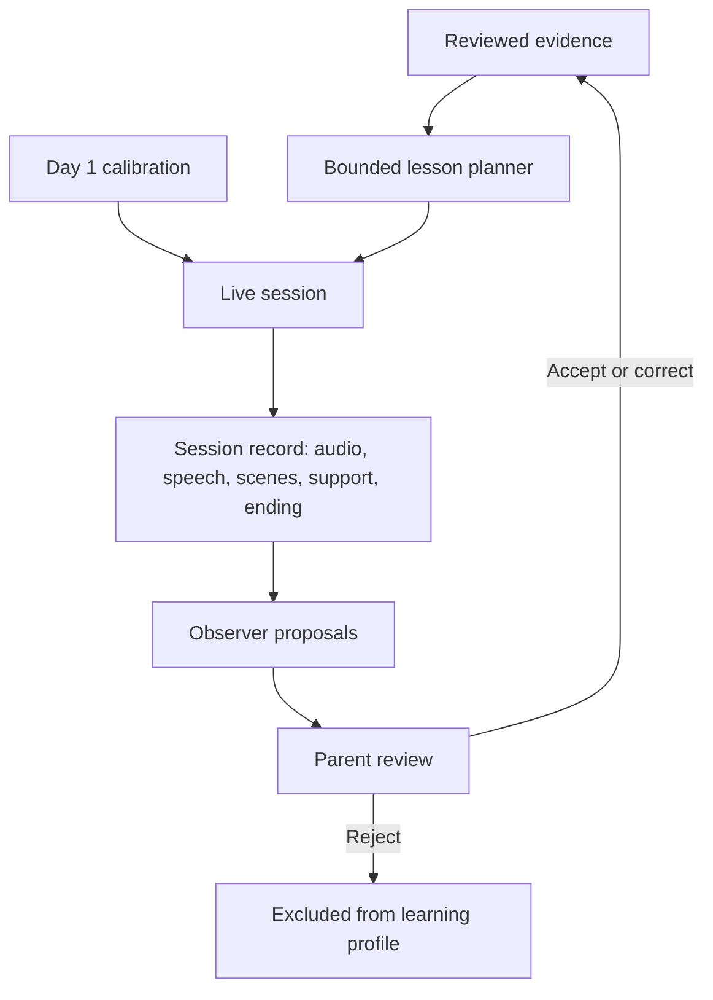

# Architecture and evidence flow

This document translates the [PRD](sprout-mvp-prd.md) into implementation boundaries. Most sections describe the proposed design; the first Convex persistence slice is identified below. Product requirements live in the PRD and are linked rather than restated here; terms are defined in [CONTEXT.md](../CONTEXT.md).

## 1. Components and authority

| Component | Responsibility | Authority boundary |
| --- | --- | --- |
| Parent browser view | Start/stop sessions, inspect evidence, submit review, record experiment feedback | Only the parent can accept, correct, or reject proposals. |
| Child browser view | Microphone interaction, voice playback, deterministic emoji scenes | Render approved scene structures; do not execute model-generated code. |
| Live voice layer | Conversation, pacing, clarification, bounded activity changes and help | Can adapt the current lesson; cannot write durable learning conclusions. |
| Application session control | Timing, active scene, stopping, durable event capture | Owns the session lifecycle and validates requested actions. |
| Observer | Interpret the ended session and propose observations | Produces proposals, not reviewed evidence. |
| Learning profile | Provide reviewed evidence and its provenance | Excludes pending and rejected observations. |
| Lesson planner | Generate the next bounded lesson and evidence-linked rationale | Reads reviewed evidence; cannot approve observations or change the learning scope. |

Live behavior can respond to the child's current utterance immediately. The parent review boundary applies to durable evidence and future lesson planning.

### Tutoring principle: what vs how

Sprout deliberately separates **what needs to be learned** from **how the live interaction unfolds**.

- The lesson planner/curriculum owns **what**: the target, evidence-backed rationale, required learning milestones, challenge/support bounds, and intended lesson structure.
- The live voice layer owns **how**: exact wording, pacing, clarification, acknowledgement, hints, recovery from interruptions, and bounded playful/theme changes that preserve the lesson intent.
- Application session control owns deterministic state and validated scene/action commits. A conversational model may propose or narrate an action, but it does not become true until the application commits it.
- Durable learning conclusions remain downstream of the recorded session and parent-review gate; the live model does not write the learning profile.

A lesson plan should therefore be a pedagogical contract, not a transcript script or rigid question/answer state machine. Different natural conversations can satisfy the same milestone. This boundary is intended to let future lesson domains reuse the same tutoring architecture without expanding the counting-only MVP now.

## 2. Flow

The initial session uses a calibration plan without invented prior evidence. Later daily sessions follow completed parent review. See [ADR 0001](adr/0001-parent-reviewed-evidence.md) for why the review boundary is deliberate.

## 3. Session lifecycle

Keep the live session's ending separate from analysis and review status.

- **Live:** starting → active → ended. A startup failure is recorded as a failed attempt, not child performance.
- **Analysis:** pending → running → ready or failed.
- **Review:** pending → complete once every proposal has a parent decision.

Record the ending reason: ordinary wrap-up, child stop, parent stop, time limit, or connection failure.

Session control enforces the PRD's [timing and stopping rules](sprout-mvp-prd.md#timing-and-stopping) in application code. The hard limit applies even if the model requests more time, and parent stop does not wait for a model decision.

On ending, stop microphone capture and voice playback and close the live connection. Ignore late controller actions. An explicit retry is a new session linked to the prior ended attempt. The current “Start a new lesson” action creates a fresh, unlinked attempt.

Persist completed exchanges incrementally so a dropped connection does not erase them. Finalize the captured record before observation generation and identify missing or incomplete material.

## 4. Evidence record

A text transcript by itself is insufficient. The Observer needs the actual scene and assistance surrounding the response, and the parent needs the recording to check what was actually said.

For the MVP, audio handling stays simple: keep one full recording per session, and timestamp utterances, scenes, and support events on the same clock as the recording, measured from session start. When the parent inspects an observation, the UI seeks the full recording to approximately the exchange's timestamp. Do not pre-slice audio per utterance, store separate audio segments, or build clip-generation infrastructure.

Suggested record fields:

| Record | Minimum information |
| --- | --- |
| Session | ID, plan ID, start/end times, ending reason, record completeness, analysis/review status, retry relationship if any |
| Session recording | One full-session audio file (Convex file storage) and its start time |
| Utterance | ID, speaker attribution including unknown, text, order, timestamp, whether the utterance was finalized or interrupted |
| Displayed scene | ID, ordered emoji items and arrangement, target quantity, display order, timestamp |
| Support event | Relevant exchange, support type, source, the spoken or displayed help, timestamp |
| Proposed observation | ID, session, quantity, observed behavior, factual description, support context, uncertainty, references to source utterances and scenes, exchange timestamp |
| Review decision | Proposal ID, accepted unchanged / corrected / rejected, corrected observation or reason where applicable, parent-added context (e.g. pointing), review time |
| Lesson plan | Target, three activity parts, themes/scenes, permitted help, rationale, reviewed-evidence references used to generate it |
| Daily evaluation | Participation judgment, actual useful adaptation and supporting references, parent repair level and a short note, notable failures, optional ratings |

The first persistence slice now defines `sessions` and `sessionEvents` in `convex/schema.ts`.
Each session is one attempt, identified by its Convex document ID, with `starting → active → ended`,
an ending reason, an optional prior-attempt link, and an optional single recording reference.
Each event has a session-relative millisecond timestamp, a server-assigned order, a caller event key,
and validated `utterance`, `scene_displayed`, or `support` data. `scene_displayed` means the scene
reached the UI; the live recorder does not use it for requested transitions. The Convex API creates,
activates, appends, finalizes, attaches recording metadata, and fetches the ordered record. Finalization
prevents later evidence writes. The existing diagnostic JSON remains separate. Full-session audio capture and MVP inspection are implemented below. Canonical records remain directly available in Convex for developer tooling; a separate manual export representation is not required for the MVP.

### Live recording (commit 2)

`LessonSession` accepts a small `SessionRecorder` interface; the browser supplies a narrow
`ConvexSessionRecorder` adapter. An ordered asynchronous queue creates the attempt before activation
and evidence writes, activates at provider `session.started`, and writes all queued evidence before
finalization. All seven application ending reasons map directly to the schema. Late callbacks and
repeated endings cannot append evidence. Network round trips do not block conversation control.

Canonical utterances use a separate full-text accumulator, rather than the bounded answer/diagnostic
window. Same-speaker fragments combine; a speaker switch finalizes the prior canonical turn,
even if the incoming Sprout transcript is untrusted or gated and omitted from evidence. The prior
turn’s quiet timer is cleared. A provider timestamp gap or 2.5 seconds of transcript quiet also
finalizes an utterance. These are approximate utterance boundaries, not provider-confirmed speech
completion. Open useful speech flushes as interrupted before ending. Provider transcript timestamps
are approximate; canonical event timestamps use milliseconds from provider session.started (zero),
matching the recording origin. Prototype diagnostics retain the attempt-creation clock. Child input retains
`child_or_nearby_speaker` attribution.

Sprout speech requires an explicit transport delivery attribution for the whole utterance. Muting
invalidates the open utterance; gated fragments are never delivered evidence. BrowserTransport
currently cannot correlate output transcript intervals to actual audible playback, so production
Sprout utterances are deliberately omitted. An unmuted audio element or resolved `play()` alone is
insufficient proof. Diagnostic output transcripts remain available. A future transport can implement
`delivered(startMs, endMs)` when it has reliable interval attribution, without changing persistence.

Scenes are appended only by the existing post-render `displayed()` confirmation. Consuming the pending
display prevents duplicate effect callbacks; the payload comes from the actual lesson scene and object
catalog, including ordered items and the wrapping row arrangement. Requested/pending transitions
are not evidence. No support events are emitted yet: instructions to offer help do not establish
what help was played. Model-generated hints, counting together, and parent assistance remain deferred
until reliable delivery/attribution exists; the recorder and schema accept support events.

Persistence failures are reported in diagnostics and a visible recording warning. The lesson continues
with unchanged timing, answer decisions, and scene control. New durable attempts have
`recordStatus: pending` while required durable evidence is being assembled. Finalization ends the
session without promoting completeness. Valid full-audio attachment atomically promotes only pending
records to `complete`: an ended session with all required durable MVP evidence including full audio.
`incomplete` means known durable evidence loss and can never be promoted by later audio success.
Future consumers may treat complete records as fully assembled; pending records remain unfinished,
and incomplete records require explicit qualification. If the browser disappears after finalization
before upload, the ended record safely remains pending without audio. After a persistence failure on
an existing attempt, the queue awaits an idempotent `markIncomplete` write before continuing. Marker failures
are reported; finalization also carries the known loss atomically, so a successful finalize leaves
`recordStatus: incomplete` even if the earlier marker write failed. This status is monotonic and
separate from lesson lifecycle and ending reason. Failed evidence writes are not
silently claimed as stored or retried; later writes and finalization are still attempted in order. An unavailable create
means no durable attempt exists and subsequent adapter operations report failure. Page hide queues
interrupted speech and finalization, but browser suspension/unload can prevent pending network writes;
already committed evidence survives. There is no unload durability guarantee in this slice.

`lib/observation-contracts.ts` defines runtime-validated Observer proposals against persisted
session-event IDs, and a separate parent-decision shape for later review work. Proposal timestamps use
the session-relative `atMs` clock. For concrete performance claims, validation uses the utterance's
`startMs`/`endMs` interval, not its event `atMs` (which is recorded when the completed utterance is
flushed). The cited scene must be the uniquely timestamped scene already displayed before speech
starts, with no scene transition during the interval. Missing speech bounds, equal-time ordering, or a
transition during speech requires an uncertain claim or omission. These checks establish consistency
with recorded timestamps; they cannot prove acoustic alignment or what was perceptually visible. A
correct total without a spoken count is quantity identification; counting
aloud requires the complete canonical spoken sequence from one through the displayed target quantity,
as well as the stated total. A short or incomplete sequence is insufficient. Recorded support can cite either canonical support
events or a `recording_review` source with the canonical recording ID, recording-relative interval, and
matching session-relative interval. Validation requires the same session, a complete record with an
available recording, an interval inside the recording duration, and an exact mapping through
`startOffsetMs`. This permits a proposal to preserve audible help context when no structured support row
exists, without creating a delivered support event. Missing or insufficient evidence remains
`not_established` or an uncertain proposal; it does not imply independence. Recording citations validate
identity and timing metadata, not whether help was semantically audible, correctly attributed, or helpful.
Parent-reported assistance, pointing, and touch-counting retain separate `parent_review` provenance and
cannot be inferred from the recording source or rewrite the original proposal. Synthetic fixtures are
contract examples, not delivered evidence or provider results.

### Durable analysis lifecycle (implemented)

`observerAnalyses` stores one run per session, independently of live session state and record integrity.
The run moves through pending, running, ready, or failed; attempts claim it atomically for a five-minute
lease and may recover an expired owner up to five total attempts. A valid fifth lease remains running;
when it expires, the next claim settles the run as failed with an explicit exhaustion reason and clears
its ownership and lease. Repeated claims return that saved terminal failure without starting a sixth
attempt. An exhausted run produces no proposals and leaves parent review pending. Active sessions and
ended records still marked pending are ineligible. An incomplete record may be analyzed, but its run
carries an explicit record-level qualification derived from the canonical integrity snapshot on every new
attempt. A retry against an incomplete record retains that qualification through success or failure; a
retry against a complete record clears stale qualification. This does not require uncertainty for
otherwise supported completed exchanges. The claim snapshots canonical ordered event content, recording
identity/metadata, and record integrity. Publication re-fetches those inputs and refuses a changed
snapshot.

Backend-only claim, failure, and publication operations own attempt tokens. The read query exposes only
run status, qualification/failure, and proposals. Publication validates each proposal against canonical
backend records, writes the complete batch and ready state transactionally, and accepts an empty batch as
a ready result. Invalid batches write nothing. The original proposal rows are immutable: retries after a
failure do not overwrite them, and repeated successful publication returns the saved batch. Stale or
expired attempt tokens cannot complete or fail the current attempt. Parent decisions remain separate and no run state approves evidence.

This local prototype supports at most 1,000 canonical events per analyzed session and at most 1,000
proposals per publication. Claim checks for an overflow event and rejects the session rather than
snapshotting a partial record. Publication rejects oversized fresh batches before writing; proposal
reads and successful retries return the complete saved batch, while pre-existing rows beyond the limit
produce an explicit error. Public recording attachment persists audio without scheduling provider work.
After durable assembly, the recorder notifies a loopback-guarded Next.js route. That route invokes a
public Node action which checks the server-only `OBSERVER_SERVER_CAPABILITY` against Convex runtime
configuration before an internal mutation schedules analysis. Direct public attachment and retry calls
cannot schedule analysis without that capability. Duplicate triggers and active/ready runs reuse
lifecycle state before any provider call. The same route can reschedule a failed run, recover an expired
owner, or start analysis for an older saved recording after a reload. If automatic notification fails,
the saved record remains available for retry. Pending records remain ineligible; complete and
known-incomplete ended records with recordings can be analyzed. Local Next.js and Convex Node runtimes
must be configured with the same high-entropy capability before enabling provider analysis; no secret
is set by this change. The provider path, limits, API compatibility evidence and remaining
alignment/suitability gates are documented in [Observer provider feasibility](observer-provider-feasibility.md).
Parent review UI remains unimplemented; durable internal review operations are described in section 5.

The browser persists only the latest durable session ID, after Convex creates the record. On reload, a
read-only Convex client fetches that record directly; inspection does not create a session or restore
microphone/controller state. The canonical transcript, events, and recording remain in Convex. A missing
or malformed local reference is reported, an inaccessible record is reported as unavailable, and a
pending record remains qualified without an Observer retry. Complete and incomplete ended records with
audio can reach the trusted retry route. This is a single latest-record pointer, not a history dashboard;
starting another durable attempt replaces the pointer while leaving earlier Convex records intact.

Record what was actually displayed, not just a requested visual action. Distinguish a spoken or interrupted prompt from text generated but never played. If delivery or scene context cannot be established, the Observer must qualify or omit the conclusion.

Support descriptions can include no help observed, a light prompt, a choice, modeling/counting together, parent-reported assistance, or unknown. A fresh example after teaching retains the context of earlier help.

Do not claim to observe pointing, eye tracking, which object was counted at each spoken number, or definite child identity from ambiguous speech. A parent's correction can add context the system could not detect.

All session data, including audio, is retained for the builder's review; see the PRD's [product boundaries](sprout-mvp-prd.md#8-product-boundaries). Audio also reaches the chosen voice provider, subject to that provider's own retention settings.

## 5. Observation and review rules

1. Analyze the finalized session record, including completed exchanges from partial sessions.
2. Propose only conclusions supported by referenced exchanges.
3. Separate correct quantity identification from counting aloud with a correct total.
4. Treat silence, missing context, unclear speech, and disrupted exchanges as uncertainty rather than incorrect answers.
5. Store the original proposals unchanged.
6. Require a parent decision for each proposal. “Accept all” is available for an unchanged summary.
7. Make only accepted or corrected observations available to the learning profile. Rejected proposals remain in the record.
8. Preserve both the original wording and correction. Do not rewrite the source transcript to make an observation appear supported.

If there are no usable observations, show that explicitly and let the parent acknowledge the empty summary. Do not invent evidence to fill the summary.

A failed Observer run leaves analysis failed and review pending; it cannot silently publish an empty successful review. Retry analysis against the saved record. Make retries idempotent so they cannot duplicate observations or reviews.

A review is final once the next plan has been generated from it. Anything missed is added in the next day's review rather than by regenerating plans.

Do not generate the next daily plan while the preceding session's analysis or review remains incomplete, including after a technical retry. Show the blocking state to the parent.

### Durable parent review

`parent_review.decide` is an internal mutation taking the session ID, analysis ID, actual
`observerProposals` row ID, and a ParentDecision input without `reviewedAt`. It resolves the
proposal, source exchange IDs and session-relative timestamp from the stored row and revalidates
the complete canonical record against the analysis snapshot. Client-provided sources, analysis
provenance, and review timestamps are not accepted. Decisions use backend wall-clock review time;
proposals, transcripts, delivered scenes and original sources remain unchanged.

`parentDecisions` records accepted, corrected or rejected decisions. `reviewedEvidence` stores only
accepted/corrected observations with references to their decision, stored proposal, analysis,
session and original sources/timestamp. Corrections require an explicit `parent_review` note.
They may resolve recorded uncertainty or correct an interpretation (including removing mistaken
support), but cannot introduce support event/recording identities or new exchange identities.
Changed interpretation is attributed to `parent_review` on the evidence row. Newly reported help,
pointing and touch-counting belong in the separately attributed `parentContext`, never in
Observer-recorded support. The corrected observation's support describes recorded support;
consumers must retain parentContext alongside it, and `not_established` never means independent.
Runtime checks enforce claim shape, outcome consistency, prototype quantity bounds, source and
text bounds, correction/rejection exclusivity and a nonempty rejection reason.

`parent_review.complete` requires READY analysis and a decision for every stored proposal, and
records repair level (`verified`, `light_correction`, `substantial_repair`) plus an optional note
of at most 1,000 characters in `sessionReviews`. Verified requires unchanged acceptances.
An empty READY batch requires `acknowledgeEmpty: true`, records acknowledgment and creates no
evidence. Incomplete records can contribute valid completed exchanges; incomplete/failed analysis
cannot be acknowledged as a successful empty review. All reads detect overflow beyond the existing
1,000-event/proposal/decision/evidence bounds rather than completing a truncated batch.

`parent_review.acceptAll` accepts the unchanged summary and completes review in one transaction,
reusing existing unchanged acceptances. Any correction, rejection or invalid stored proposal makes
the whole operation fail without writes. Identical decision/completion retries return their
existing IDs and preserve original timestamps; conflicting repeats fail. This slice provides no
editing/replacement operation, even before planning. A future explicit revision operation may be
added before plan consumption, but must replace decision/evidence consistently and enforce the
finality boundary. No planner or plan-consumption marker exists yet; completion does not claim
that a plan was generated. The documented rule that review becomes final after plan generation
remains a requirement for the later planner slice.

`parent_review.get` exposes stored row IDs, decisions and per-session completion for internal
inspection. `parent_review.forPlanning` accepts 1–100 unique prerequisite session IDs and returns
`{ blocked, reason, evidence }`. It returns no evidence at all if any supplied session lacks READY
analysis or complete parent review, including technical retries; rejected/pending proposals never
enter it. A changed canonical snapshot throws and therefore also blocks planning. The later planner
must supply the full prerequisite session set and use this interface; this slice does not select
experiment history or infer profiles, mastery or adaptations.

Review mutations and the planning gate remain internal. The parent UI reaches them only through
the capability-gated bridge described below. Local generated API typing is updated by hand; no
Convex CLI or deployment is needed for local tests. Live schema deployment and provider suitability
remain unverified.

### Parent review bridge and inspection (issue #5, commit 5)

The saved-session inspector includes an explicit parent review panel. Browser recovery uses the existing
latest-session reference and never creates or resumes a lesson. Status reads distinguish not started,
pending, running, failed, and READY; only an explicitly empty READY batch can be acknowledged as empty.
The proposed summary lists the immutable proposal descriptions. Each original and saved decision remains
visible with canonical utterance/scene/support context and exchange time. Recording playback uses the
existing full recording and subtracts its `startOffsetMs`; positions remain approximate.

`POST /api/parent-review` accepts a discriminated command: `get {sessionId}`, `decide
{sessionId, analysisId, proposalRowId, decision}`, `acceptAll {sessionId, analysisId, note?}`, or
`complete {sessionId, analysisId, repairLevel, note?, acknowledgeEmpty?}`. Decisions omit `reviewedAt`;
parent explanations use `parentContext` with `parent_review` provenance. The same-origin loopback guard
runs before body parsing or RPC. Bodies and the public action's serialized command are bounded to 16 KiB,
with strict field validation; notes are at most 1000 characters. This is the existing local prototype
security model, not an authenticated parent account system.

The Next server supplies `OBSERVER_SERVER_CAPABILITY` to `parent_review_action.request`; the public
Convex action validates it before **every** internal read or write, independently of Next validation.
It routes writes to existing `parent_review.decide`, `acceptAll`, and `complete`. The internal
`parent_review.inspect` read shares the same canonical snapshot/proposal validation as `get` for READY
records, and also supports pre-READY status reads. Its JSON return is bounded to 2 MB. The browser view
contains only analysis status, incomplete qualification, proposals, decisions, completion metadata and
canonical evidence sources (`id`, `eventKey`, `atMs`, `evidence`). Backend event IDs resolve actual
proposal references even though the original recording inspector uses event keys. Neither capability,
provider diagnostics, attempt tokens, nor internal snapshots enter this view. Route failures use fixed
safe messages, never raw backend errors. No Convex CLI or deployment is necessary for mocked tests.

Correction controls preserve canonical target quantity and source identities, permit attributed parent
interpretation/speaker corrections, and keep missing/ambiguous scene timing uncertain. Newly reported
assistance and pointing/touch-counting go only into parent context. Saved decisions remain immutable;
identical retries are idempotent and accept-all cannot replace corrections/rejections. Accept-all is an
explicit atomic acceptance and verified completion. Otherwise completion requires all decisions,
repair level, and optional note; verified completion requires unchanged acceptances. Empty completion
requires acknowledgment and creates no evidence. No next lesson or planner is called.

During a write the panel prevents duplicate actions. An uncertain response triggers a saved-state read
and reconciles the exact intended payload against a same-session, same-analysis READY snapshot.
An identical persisted decision or full completion clears uncertainty without a duplicate write;
comparison ignores backend-owned review/completion timestamps but preserves all input values.
A different immutable decision or completion (including note, repair level or empty acknowledgment)
shows a conflict and the actual saved result, discards the impossible retry, and permits remaining
review actions. Accept-all also conflicts with stored corrections/rejections; partial unchanged
acceptances without completion remain unresolved. Original proposals and saved decisions never change.
If no authoritative result establishes the outcome, retain the exact original payload and block
competing decisions/completion/Observer retry. A successful refresh enables only that identical retry;
a failed refresh or changed analysis/proposal identity keeps it disabled. Reads/writes from an unmounted
session panel cannot update the next inspection, and reads verify the returned session identity.
Synthetic browser tests mock every review, Observer retry, recording and Convex service call. Actual
capability configuration, deployed RPC validation and live recording/provider review remain deployment
and full-flow verification work for the next slice.

## 6. Planning rules

The planner receives:

- The current learning scope, set in code by the builder (quantities 1–5 initially).
- Reviewed responses for each quantity, including context and support.
- Recent delivered activities and themes.
- Child interests and reviewed contextual notes that are available.
- The three-part lesson structure and timing limits.

It selects one main target, a warm-up, and a fresh example. It can revisit a difficulty, vary the context to check a prior response, or adjust challenge/support within the scope. It must not infer permanent mastery from a single success or create developmental labels.

The plan describes pedagogical intent rather than exact dialogue. It should carry the target, milestones, support/challenge bounds, and evidence-linked rationale needed to keep the lesson on track while leaving wording, pacing, clarification, and moment-to-moment scaffolding to the live voice layer.

Every post-calibration plan includes a plain-language rationale and references to the reviewed evidence behind its learning choices. The rationale must make the causal link explicit, so it answers: “What would this lesson have done differently if the referenced observation did not exist?” The planner does not generate a second, counterfactual lesson. Cosmetic personalization or a changed theme alone is insufficient.

- **Causal:** “Yesterday she identified five correctly only after counting together, so today Sprout presents a fresh group of five and waits before offering help.”
- **Not causal:** “Yesterday she practiced five, so today Sprout practices five again with ducks.”

Preserve that rationale and compare it with what actually occurred. A planned adaptation that was never delivered cannot count as a useful adaptation.

If there is no usable reviewed evidence, explicitly use a calibration-style plan and identify the lack of evidence. Do not describe it as personalization.

During play, a new theme can replace the original setting while preserving the objective and bounded scene rules. Neither a live model nor Jev may change the learning scope.

## 7. Stack and feasibility gate

Retain the proposed Next.js/React/TypeScript application and Convex persistence. The experiment runs locally on the builder's MacBook; Vercel deployment is deferred. The repository contains the slice 1 GPT-Live-1 voice prototype ([baseline findings](gpt-live-baseline.md)) and the standalone Convex session-record foundation; live evidence persistence is wired; Observer and planner integrations are not implemented.

GPT-Live 1 is the initial voice candidate. OpenAI documents the model as `gpt-live-1`. Vercel documents Jev as `typesafe-ai/jev`; the prototype calls TypeSafe's own API directly and pins `jev-1.13.0`, because the advance threshold is calibrated against that version. Suitability for this child's speech is still unestablished: the results so far come from synthetic adult speech. Sources checked 2026-09-22: [GPT-Live 1](https://developers.openai.com/api/docs/models/gpt-live-1), [Jev](https://vercel.com/ai-gateway/models/jev).

First implement one hardcoded activity in a browser on a MacBook. Record the actual browser/version used; iPad compatibility is deferred. Validate:

- Microphone access and a usable live connection.
- Thinking pauses, self-correction, genuine interruption, and response pacing.
- Whether the timestamped transcript and full-session recording are sufficient to inspect the relevant exchange.
- Coordination between spoken prompts and the scene actually displayed.
- Brief goodbye, parent stop, six-minute limit, and connection-failure cleanup.

Use what this test reveals to decide where Jev fits. Do not commit to per-utterance evaluation, score scales, or model confidence thresholds before that need is established.

That test led to one bounded use of Jev, kept after the [answer experiment](jev-answer-experiment.md): a single Noul question decides whether the child's count matches the displayed scene, and the application — not the live model — advances the scene. The probability is a control signal only and never becomes stored learner evidence. Jev has no other runtime responsibility; `choice` and `score` remain unused.

The post-session Observer and planner need structured, validated output; their exact models are not yet selected. Model confidence values are not a substitute for evidence or parent review.

Issue #5's provider feasibility decision and documented first candidate path are in
[Observer provider feasibility](observer-provider-feasibility.md). The recommendation is a saved-file
transcription stage followed by a text model with Structured Outputs and local cross-validation;
API compatibility is documented, while model suitability and timestamp alignment remain unverified.

## 8. Implementation constraints and verification

Run locally without user accounts. Provider credentials stay on the server and never reach the browser.

Read the installed Next.js documentation as required by [AGENTS.md](../AGENTS.md) before writing application code.

Verify the following behaviors before the experiment:

| Scenario | Required result |
| --- | --- |
| Child says “five” with no count sequence | Record quantity identification, not counted-aloud behavior. |
| Child repeats a supplied answer | Record the support; do not infer an independent response. |
| Parent marks a proposal assisted or inaccurate | Preserve the original; only the accepted correction can inform a future plan. |
| Observation is pending or rejected | Exclude it from the learning profile and planner inputs. |
| Scene changes or speech is interrupted | Evidence cites the relevant actual context or remains uncertain. |
| Child is silent, stops, or connection fails | End/qualify appropriately; do not manufacture a wrong answer. |
| Observer execution is retried | Do not duplicate proposals or bypass review. |
| Session reaches the limit | End by six minutes and release media resources. |
| Parent opens an observation | The full session recording seeks to approximately the exchange's timestamp, alongside transcript and scene. |
| Next lesson cites an observation | The observation is reviewed, and the rationale states what the lesson changed because of it. |

### Full-session audio (commit 3)

BrowserTransport mixes the microphone directly into a MediaStreamAudioDestinationNode and remote
WebRTC audio through a GainNode into that same destination. No microphone signal goes to speakers.
The existing audio element still plays Sprout; the remote recording gain is zero until play() succeeds
and whenever setOutputBlocked(true) mutes playback. Child capture remains enabled throughout.
One MediaRecorder starts synchronously at provider session.started and stops immediately on every
ending, including partial attempts. Final dataavailable chunks form one Blob on stop; no utterance clips
are created. Runtime MIME selection prefers supported Opus formats, with browser-default fallback.
The Blob's actual MIME type, startOffsetMs (zero relative to live session start), and monotonic elapsed
durationMs are attached to the ended session. Canonical sessionEvents.atMs uses session.started as
zero, sharing the recording origin and provider-relative utterance startMs/endMs. Canonical evidence
requires that live start boundary. Attempt diagnostics retain the earlier attempt-creation clock;
liveStartedAtMs reports the startup delay on that clock.

The persistence queue flushes evidence, finalizes, then requests a Convex upload URL, POSTs the Blob,
and attaches its storage ID. Media tracks, nodes, context, detector and playback are released without
waiting for network writes. Capture or attachment failure uses the existing incomplete marker and
warning; a startup attempt without usable audio is incomplete. Browser suspension still offers no
unload durability guarantee. Production Sprout delivered evidence remains omitted when delivery intervals cannot be verified.
Generated transcripts are retained separately as analysis timeline events; full audio is authoritative for captured speech.

### MVP inspection and explicit retry (commit 4)

Ended attempts expose their durable reference through the recorder/session snapshot seam. A private
builder inspector fetches canonical Convex data and ordered events, with explicit pending, complete,
and incomplete wording. Partial evidence stays visible. A Refresh record button handles finalization
and audio upload races without indefinite polling. Missing records/audio are shown honestly.

One full recording uses a Convex storage playback URL; evidence buttons seek approximately to
`(event.atMs - recording.startOffsetMs) / 1000`, clamped to the available duration. No clips are created.
The timeline preserves persisted speaker attribution and displays utterances, actually displayed scenes,
and any support evidence. Convex is the canonical session-record source of truth; deeper developer
analysis can use Convex tooling such as Convex MCP / Codex. A dedicated JSON/audio export or download
workflow is intentionally not required for the MVP. Local prototype diagnostic downloads remain separate.

Retry is available only for a fetched ended durable attempt. It disposes the old runtime and creates
a fresh transport, recorder, controller, and linked session (`retryOf`), preserving the original record.
Start a new lesson creates an unlinked attempt. The ended reference and reader are held independently
of the live controller; late updates from old controllers cannot replace the new attempt's UI. The latest
durable ID is also saved in browser storage and recovered by a fresh read-only recorder after reload, so
the saved record, recording seek controls, and trusted Observer retry remain available without creating
a new lesson. Only the ID is stored locally; active lesson state is never resumed.

### Conversation timeline (commit 5)

`sessionEvents` contains exactly one of `evidence` or `timeline`, sharing event-key idempotency,
server write order, integrity handling, and `session.started = 0` timestamps. Existing evidence
rows remain readable. `Evidence` retains conservative learner/nearby-speaker attribution,
actually displayed scenes, and only delivery-verified tutor utterances. `TimelineEvent` stores
provider generation and application control facts separately. Jev probability is only a control
result, never mastery or learner confidence.

All finalized/interrupted Sprout utterances are retained as `sprout_generated_utterance`, even
when gated or delivery is unknown. Accumulators preserve full text, approximate provider/media
start/end, and first/last browser observation offsets without writing every delta. Generated rows
are positioned at first observation; their final observation and finalization state remain explicit.
Child/nearby utterance evidence also retains both observation offsets. Activation persists the browser
start timestamp so a queued network write does not shift the session document clock. Inspector combines events
in timestamp order (server order breaks ties), clearly labels analysis and delivery uncertainty,
and retains full-audio seeking.

App-observed microphone start/stop events retain quiet duration and estimated acoustic end,
which can be negative near session start and is not an exact child speech boundary. Gate state
begins permitted and records only effective changes with reasons. Evaluation requests/results
share a scene plus answer-version correlation key, turn signal, request delay, returned latency,
status/reason, and deterministic decision (including stale results). Scene commits separately
record from/to indices and the answer key; displayed evidence still requires actual display.

Generated transcript = what GPT-Live produced. Playback timeline = what the app permitted or
blocked, with no claim of per-utterance audibility. Full recording = what the capture path retained.
Delivered evidence = only claims strong enough to represent learner experience. `audio.play()`
resolution does not establish utterance delivery. Existing one-file gated capture stays unchanged;
no clips, export/download workflow, naturalness score, or fake audible-start events are added.

### GPT-Live and Jev evaluation cooperation (issue #40)

For numeric counting answers, GPT-Live may request a client delegation, but the application
identifies the answer from its own scene, transcript revision, answer version, and active source.
The delegation ID correlates the request; it cannot select an answer. The application-triggered
evaluation remains live without a delegation, and both triggers share one Jev result for that
answer identity. Ambiguous, stale, superseded, or retired-source delegations are declined.

Jev keeps the existing `jev-1.13.0` question and `0.90` threshold. The app validates the result,
commits at most one scene transition, confirms the displayed scene, then sends explicit result
context. The general application context uses `delegation_id: null`; an associated request also
gets an ID-linked result. Playback remains behind the existing correction, display, output, and
source-isolation gates. The 30-second delegation association age is a local matching heuristic,
not a provider recommendation or a wait before application evaluation.

Live validation is synthetic adult speech through the browser microphone and real GPT-Live/Jev.
Generated tutor transcripts, media activity, and context acknowledgments are separate observations:
an acknowledgment estimates context injection, while transcript or decoded-media activity does
not establish acoustic onset or that the child heard the content. See [issue #40 findings](issue-40-cooperation-findings.md)
for the targeted outcomes, retained artifacts, timing, and remaining live gaps.
