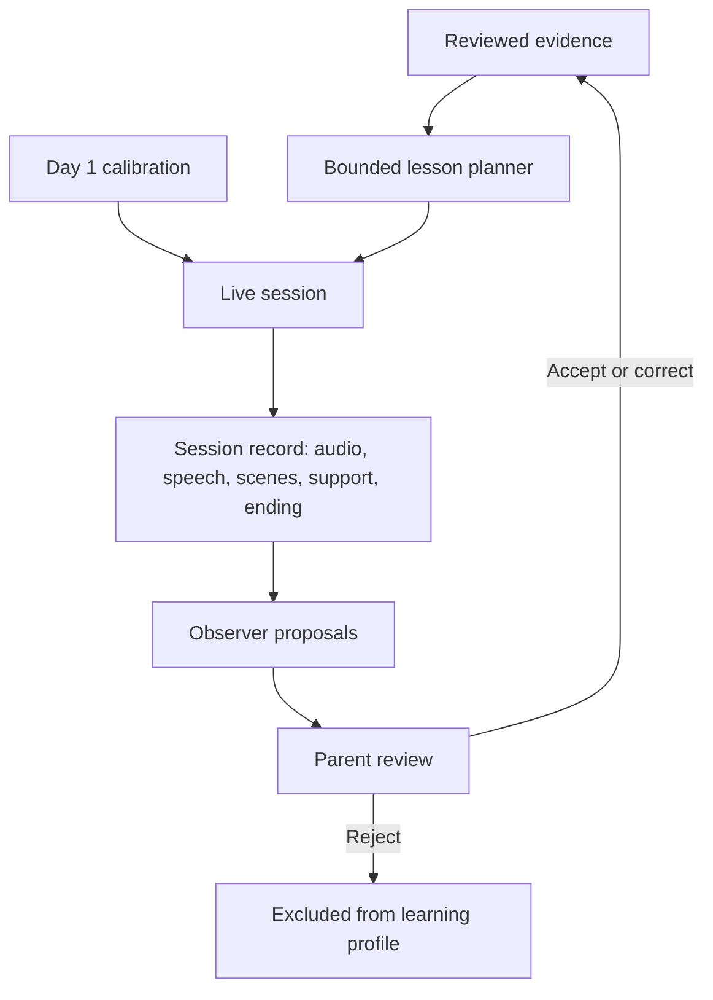

# Architecture and evidence flow

This document translates the [PRD](sprout-mvp-prd.md) into implementation boundaries. It describes a proposed design, not existing functionality. Product requirements live in the PRD and are linked rather than restated here; terms are defined in [CONTEXT.md](../CONTEXT.md).

## 1. Components and authority

| Component | Responsibility | Authority boundary |
| --- | --- | --- |
| Parent browser view | Start/stop sessions, inspect evidence, submit review, record experiment feedback | Only the parent can accept, correct, or reject proposals. |
| Child browser view | Microphone interaction, voice playback, deterministic emoji scenes | Render approved scene structures; do not execute model-generated code. |
| Live voice layer | Conversation, pacing, clarification, bounded activity changes and help | Can adapt the current lesson; cannot write durable learning conclusions. |
| Application session control | Timing, active scene, stopping, durable event capture | Owns the session lifecycle and validates requested actions. |
| Observer | Interpret the ended session and propose observations | Produces proposals, not reviewed evidence. |
| Learning profile | Provide reviewed evidence and its provenance | Excludes pending and rejected observations. |
| Lesson planner | Generate the next bounded lesson and evidence-linked rationale | Reads reviewed evidence; cannot approve observations or change the learning scope. |

Live behavior can respond to the child's current utterance immediately. The parent review boundary applies to durable evidence and future lesson planning.

## 2. Flow

The initial session uses a calibration plan without invented prior evidence. Later daily sessions follow completed parent review. See [ADR 0001](adr/0001-parent-reviewed-evidence.md) for why the review boundary is deliberate.

## 3. Session lifecycle

Keep the live session's ending separate from analysis and review status.

- **Live:** starting → active → ended. A startup failure is recorded as a failed attempt, not child performance.
- **Analysis:** pending → running → ready or failed.
- **Review:** pending → complete once every proposal has a parent decision.

Record the ending reason: ordinary wrap-up, child stop, parent stop, time limit, or connection failure.

Session control enforces the PRD's [timing and stopping rules](sprout-mvp-prd.md#timing-and-stopping) in application code. The hard limit applies even if the model requests more time, and parent stop does not wait for a model decision.

On ending, stop microphone capture and voice playback and close the live connection. Ignore late controller actions. An explicit retry is a new session linked to the same experiment day.

Persist completed exchanges incrementally so a dropped connection does not erase them. Finalize the captured record before observation generation and identify missing or incomplete material.

## 4. Evidence record

A text transcript by itself is insufficient. The Observer needs the actual scene and assistance surrounding the response, and the parent needs the audio to check what was actually said.

Suggested record fields:

| Record | Minimum information |
| --- | --- |
| Session | ID, experiment/day, plan ID, start/end times, ending reason, record completeness, analysis/review status, retry relationship if any |
| Audio | Session audio file (Convex file storage), with offsets so each utterance can be replayed |
| Utterance | ID, speaker attribution including unknown, text, order/time, audio offset, whether the utterance was finalized or interrupted |
| Displayed scene | ID, ordered emoji items and arrangement, target quantity, display order/time |
| Support event | Relevant exchange, support type, source, and the spoken or displayed help |
| Proposed observation | ID, session, quantity, observed behavior, factual description, support context, uncertainty, references to source utterances and scenes |
| Review decision | Proposal ID, accepted unchanged / corrected / rejected, corrected observation or reason where applicable, parent-added context (e.g. pointing), review time |
| Lesson plan | Target, three activity parts, themes/scenes, permitted help, rationale, reviewed-evidence references used to generate it |
| Daily evaluation | Participation judgment, actual useful adaptation and supporting references, notable failures, optional ratings |

This is a conceptual contract; concrete Convex schemas and provider event mappings are implementation work.

Record what was actually displayed, not just a requested visual action. Distinguish a spoken or interrupted prompt from text generated but never played. If delivery or scene context cannot be established, the Observer must qualify or omit the conclusion.

Support descriptions can include no help observed, a light prompt, a choice, modeling/counting together, parent-reported assistance, or unknown. A fresh example after teaching retains the context of earlier help.

Do not claim to observe pointing, eye tracking, which object was counted at each spoken number, or definite child identity from ambiguous speech. A parent's correction can add context the system could not detect.

All session data, including audio, is retained for the builder's review; see the PRD's [product boundaries](sprout-mvp-prd.md#8-product-boundaries). Audio also reaches the chosen voice provider, subject to that provider's own retention settings.

## 5. Observation and review rules

1. Analyze the finalized session record, including completed exchanges from partial sessions.
2. Propose only conclusions supported by referenced exchanges.
3. Separate correct quantity identification from counting aloud with a correct total.
4. Treat silence, missing context, unclear speech, and disrupted exchanges as uncertainty rather than incorrect answers.
5. Store the original proposals unchanged.
6. Require a parent decision for each proposal. “Accept all” is available for an unchanged summary.
7. Make only accepted or corrected observations available to the learning profile. Rejected proposals remain in the record.
8. Preserve both the original wording and correction. Do not rewrite the source transcript to make an observation appear supported.

If there are no usable observations, show that explicitly and let the parent acknowledge the empty summary. Do not invent evidence to fill the summary.

A failed Observer run leaves analysis failed and review pending; it cannot silently publish an empty successful review. Retry analysis against the saved record. Make retries idempotent so they cannot duplicate observations or reviews.

A review is final once the next plan has been generated from it. Anything missed is added in the next day's review rather than by regenerating plans.

Do not generate the next daily plan while the preceding session's analysis or review remains incomplete, including after a technical retry. Show the blocking state to the parent.

## 6. Planning rules

The planner receives:

- The current learning scope, set in code by the builder (quantities 1–5 initially).
- Reviewed responses for each quantity, including context and support.
- Recent delivered activities and themes.
- Child interests and reviewed contextual notes that are available.
- The three-part lesson structure and timing limits.

It selects one main target, a warm-up, and a fresh example. It can revisit a difficulty, vary the context to check a prior response, or adjust challenge/support within the scope. It must not infer permanent mastery from a single success or create developmental labels.

Every post-calibration plan includes a plain-language rationale and references to the reviewed evidence behind its learning choices. Cosmetic personalization alone is insufficient.

Example:

> “Revisit five with ducks because yesterday's total followed counting together; offer a fresh group before supplying help.”

Preserve that rationale and compare it with what actually occurred. A planned adaptation that was never delivered cannot count as a useful adaptation.

If there is no usable reviewed evidence, explicitly use a calibration-style plan and identify the lack of evidence. Do not describe it as personalization.

During play, a new theme can replace the original setting while preserving the objective and bounded scene rules. Neither a live model nor Jev may change the learning scope.

## 7. Stack and feasibility gate

Retain the proposed Next.js/React/TypeScript application and Convex persistence. The experiment runs locally on the builder's MacBook; Vercel deployment is deferred. The existing repository is a Next.js starter; backend, voice, and model integrations are not implemented.

GPT-Live 1 is the initial voice candidate. OpenAI documents the model as `gpt-live-1`. Vercel documents Jev as `typesafe-ai/jev`; it is expected to help with bounded lesson control but remains optional, not a product dependency. Public documentation does not establish account access or suitability for this child's speech. Sources checked 2026-09-22: [GPT-Live 1](https://developers.openai.com/api/docs/models/gpt-live-1), [Jev](https://vercel.com/ai-gateway/models/jev).

First implement one hardcoded activity in a browser on a MacBook. Record the actual browser/version used; iPad compatibility is deferred. Validate:

- Microphone access and a usable live connection.
- Thinking pauses, self-correction, genuine interruption, and response pacing.
- Whether recorded speech and audio are sufficient to inspect the relevant exchange.
- Coordination between spoken prompts and the scene actually displayed.
- Brief goodbye, parent stop, six-minute limit, and connection-failure cleanup.

Use what this test reveals to decide where Jev fits. Do not commit to per-utterance evaluation, score scales, or model confidence thresholds before that need is established.

The post-session Observer and planner need structured, validated output; their exact models are not yet selected. Model confidence values are not a substitute for evidence or parent review.

## 8. Implementation constraints and verification

Run locally without user accounts. Provider credentials stay on the server and never reach the browser.

Read the installed Next.js documentation as required by [AGENTS.md](../AGENTS.md) before writing application code.

Verify the following behaviors before the experiment:

| Scenario | Required result |
| --- | --- |
| Child says “five” with no count sequence | Record quantity identification, not counted-aloud behavior. |
| Child repeats a supplied answer | Record the support; do not infer an independent response. |
| Parent marks a proposal assisted or inaccurate | Preserve the original; only the accepted correction can inform a future plan. |
| Observation is pending or rejected | Exclude it from the learning profile and planner inputs. |
| Scene changes or speech is interrupted | Evidence cites the relevant actual context or remains uncertain. |
| Child is silent, stops, or connection fails | End/qualify appropriately; do not manufacture a wrong answer. |
| Observer execution is retried | Do not duplicate proposals or bypass review. |
| Session reaches the limit | End by six minutes and release media resources. |
| Parent opens an observation | The linked audio segment replays alongside transcript and scene. |
| Next lesson cites an observation | The observation is reviewed and relevant to the actual learning adjustment. |
