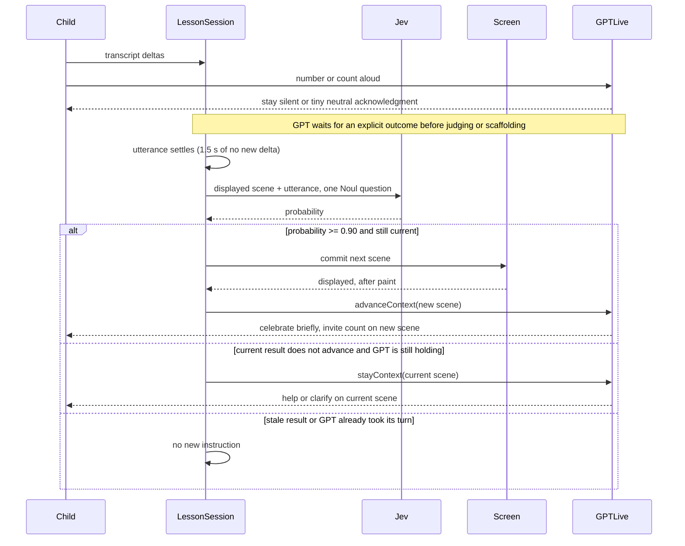

# Jev answer evaluation: can it drive scene advancement?

Findings for [issue #3](https://github.com/hurley87/sprout/issues/3). The [GPT-Live baseline](gpt-live-baseline.md) is the frozen comparison point and is not restated here.

Issue #2 established that GPT-Live-only lesson control is unreliable: whether the model delegated to advance the scene varied run to run with identical input, and the one real interactive session never delegated at all. This experiment tests one narrow hypothesis:

> Can Jev reliably decide whether the learner correctly counted the objects currently displayed, so the application can advance the scene itself?

Everything else stays where it was. GPT-Live still owns the conversation, personality, pacing and scaffolding. Silence handling, stopping, wrap-up and the time limit remain application-owned and deterministic.

## Verdict

**Keep the narrow Jev answer-evaluation responsibility. Keep the `counting-jev-2` pause/release synchronization for now.** The original `counting-jev-1` experiment established whether the narrow Jev responsibility should be kept: all 41 correct answers advanced, there were no false advances in the tested non-correct cases, consistency was strong, and the original decision-quality and latency criteria were met. It also exposed the mid-sentence synchronization seam.

`counting-jev-2` was a subsequent synchronization experiment, not a rerun of the original keep gate. Across 15 successful advances, Sprout had no meaningful turn in progress: 14 had zero Sprout words before the advance instruction and one had only a neutral “Oh!”. The observed mid-sentence advance seam was eliminated in this sample. The tradeoff is a longer quiet period: median last learner transcript delta to advance instruction was about 3.55 s, and to Sprout's first word about 4.53 s. Three `correct_once` attempts failed end-to-end because the evaluation/provider pipeline did not complete. Therefore this follow-up sample does not independently establish the original >=90% advancement or <=~2.5 s latency criteria. See [Before and after synchronization](#before-and-after-synchronization) for full timing and failure details. Treat the longer pause and occasional incomplete evaluation/provider attempts as known limitations and follow-up reliability work.

The pre-registered keep criteria belong specifically to `counting-jev-1`: correct-answer advancement of at least 90%, no false advancements, added median latency at most about 2.5 s, and no new scene/speech desync failures. That original experiment met those criteria.

## What was built

One semantic decision is delegated, behind one seam. [`lib/answer.ts`](../lib/answer.ts) holds the question, the criteria, the threshold, the settle rule and the `EvaluateAnswer` type; nothing in the lesson knows which model answers. [`lib/jev.ts`](../lib/jev.ts) is the server-side TypeSafe client, reached through [`/api/evaluate`](../app/api/evaluate/route.ts) so the credential never enters the browser. Removing Jev means deleting those three files and restoring one branch in [`lib/session.ts`](../lib/session.ts).



GPT-Live no longer has a scene capability. Its `counting-jev-2` prompt says the app owns the screen and will tell it after a change. It also asks Sprout to pause after a number or count, without praising, correcting, recounting, helping, or asking another question until the app reports the outcome. `stayContext(...)` explicitly releases that pause when the scene stays put; it is sent only while `holding()` finds at most four words of Sprout speech since the child last spoke. If Sprout already continued, the app does not add a redundant non-advance instruction. On a confident, current answer, the app changes the scene first and sends `advanceContext(...)` after display. `holding()` does not gate this advance path; the live test below specifically checks whether the prompt keeps that path clear. The original 36 sessions had no unsolicited delegation. One of the new correct-answer attempts did, and the app refused it.

### The question

Type `noul`, id `countedDisplayed`, asked of `jev-1.13.0`:

> Did the learner correctly count the objects currently displayed?

with criteria:

- **true**: "The learner's final answer gives the same total as the displayed quantity, either by naming that total or by counting up to it and stopping there. A self-correction counts: judge only the answer they settled on."
- **false**: "The final answer gives a different number, gives no total at all, is a guess the learner is asking about rather than stating, says they do not know, or is about something other than counting what is displayed."

The state is only what the decision needs, for example:

```json
{
  "displayed": { "object": "butterflies", "quantity": 3, "description": "3 butterflies" },
  "learnerUtterance": "One, two, three!"
}
```

The displayed scene is derived on the server from the scene index, so a compromised or confused client cannot describe a scene that is not on screen. The probability is used only as a control signal. It is written to in-tab diagnostics as `answer.evaluated` and is never stored as a learner assessment; the [architecture document](architecture.md#5-observation-and-review-rules) reserves learning conclusions for the Observer and parent review.

The model version is pinned rather than `jev-latest`, because the threshold below is calibrated against it.

### The threshold: 0.90

Chosen **before** any comparison run, from a labeled text-only calibration set (`npm run test:jev`, 30 utterances, 5 runs each, 150 calls). Full output in `test-results/jev-calibration/results.json`.

| Group | Probability range |
| --- | --- |
| Should advance (12 cases: plain totals, counting sequences, hesitant answers, self-corrections) | 0.96 – 0.99 |
| Must not advance (18 cases: wrong totals, "I don't know", "One?", thinking noises, off topic, Sprout's own speech echoed back) | 0.01 – 0.81 |

Any threshold in (0.81, 0.96] separates the set; 0.90 sits in the middle with margin on both sides. Repeat spread within a case was at most 0.06, and usually 0.00–0.01.

Two calibration cases are worth naming. "A duck!" scored 0.80–0.81, the highest non-advancing value: it implies one duck without stating a total, and it is the case that ruled out a 0.80 threshold. "I see 1 duck on the screen. How many can you count?", Sprout's own sentence in case it is echoed into the input transcript, scored 0.62–0.67 — below the threshold, but the smallest safety margin among the clearly-wrong cases.

### Knowing when an answer is finished

GPT-Live emits no authoritative turn-completed event, only `session.input_transcript.delta` fragments, so the application defines completeness itself. An utterance is judged complete once **1.5 s** passes with no new fragment; every fragment restarts the wait. This matters: the transcript regularly splits one answer across fragments with Sprout talking in between, and fragment-level evaluation would judge "Two?" before hearing "No, wait. One!".

Four further guards stop a decision from being applied to the wrong moment:

- Each `(utterance start, text)` version is evaluated at most once, so an unchanged answer is never re-judged. A revision is a new version and is judged again.
- A result is discarded as stale if, while it was in flight, the child said more, the scene changed, or the lesson left the active state.
- Nothing is evaluated while a scene is waiting to be displayed, on the last scene, during wrap-up or goodbye, or when the transcript guard has recognised a stop request.
- A failed or timed-out evaluation (3 s) is treated as uncertain: no advance, and the lesson is never failed because of it.

In the 36 sessions, 17 of the 70 evaluations were built from speech that arrived as more than one transcript row, each judged once as joined text. There were no duplicate evaluations and no partial-utterance evaluations.

## Results

The original `counting-jev-1` experiment used 36 real sessions on 2026-09-23, headless Chromium 153, against real `gpt-live-1` and real `jev-1.13.0`. It is the experiment that established whether to keep the narrow Jev responsibility and to which the pre-registered keep criteria apply. The later `counting-jev-2` experiment used the same real models and synthetic-child method—macOS text-to-speech on a fixed timeline fed in as a fake microphone, which cannot react to Sprout—to test synchronization separately. Run with `node scripts/live-matrix.mjs <scenario> --repeat N`.

### Original `counting-jev-1` experiment: advancement

| | Evaluations | Advanced |
| --- | --- | --- |
| Correct count | 41 | **41 (100%)** |
| Wrong total, "I don't know", off topic, acknowledgements, thinking noises | 25 | **0** |
| Ambiguous: right number, wrong object ("Three butterflies" with 3 strawberries shown) | 4 | 0 |

Probabilities were bimodal with a wide empty band. Everything that advanced scored **0.92 or above**; everything that did not scored **0.50 or below**. No evaluation landed between 0.51 and 0.91. The threshold could have been anywhere in that range without changing a single outcome.

### Consistency across equivalent inputs

| Scenario | Runs | Advanced | Probabilities |
| --- | --- | --- | --- |
| "One!" repeated identically | 5 | 5 | 0.98 every time |
| "One duck." | 2 | 2 | 0.99, 0.99 |
| "There's one!" | 2 | 2 | 0.98, 0.98 |
| "Just one." | 2 | 2 | 0.97, 0.98 |
| "I count one!" | 2 | 2 | 0.98, 0.99 |
| "Two? No, wait. One!" | 3 | 3 | 0.97, 0.92, 0.97 |
| "One! No, three." | 2 | 0 | 0.16, 0.11 |
| "Five!" | 3 | 0 | 0.02, 0.02, 0.02 |
| "Umm... I don't know." | 3 | 0 | 0.03, 0.03, 0.02 |
| `progression` (multi-scene) | 3 | 3 scenes each | identical pattern all three runs |

Transcription varied between runs of the same script — "One!" came through as `One` in three runs and `1` in two — and the probability was 0.98 in all five. Self-correction worked in both directions: the answer settled on is the one judged.

### Original `counting-jev-1` latency

| Interval | Median | Range |
| --- | --- | --- |
| Jev call, browser to browser | 276 ms | 152 – 519 ms |
| Decision to new scene on screen | 272 ms | 153 – 376 ms |
| **Child's last word to new scene** | **1777 ms** | 1659 – 1882 ms |

About 1.5 s of that 1.8 s is the application's own settle wait, not the model. In these original runs, the wait was usually filled by GPT-Live speaking early. The new runs below measure the actual pause and include slower Jev responses; the old latency figures must not be carried forward as the current listening experience.

### Original `counting-jev-1` scene and speech coordination

Across all 41 advances, the instruction telling GPT-Live about the new scene was sent **0–35 ms after** the scene reached the DOM, median 11 ms, and never before it. Sprout never named a quantity or object that was not on screen. The clearest example is the ambiguity case: with strawberries displayed, the child said "Three butterflies", Jev returned 0.48, the scene stayed put, and Sprout said "I hear you, and I'm still seeing strawberries here. Can we count the strawberries one at a time?"

### Full-length lesson

The 5½-minute `time_limit` run advanced five times and reached **all six scenes**; the #2 baseline reached four. Wrap-up at 4:31, goodbye at 5:01, "Bye for now!" spoken, closed at 5:09 — unchanged from the baseline. On the final scene the child counted "one two three four five" and, correctly, no evaluation was made: there is nothing to advance to.

## Original comparison with the #2 baseline

| | #2 (GPT-Live decides) | Original `counting-jev-1` (Jev decides) |
| --- | --- | --- |
| Correct answer advances | 2 of 4 progression runs cleanly; 0 in the real interactive run | 41 of 41 |
| Same input, same outcome? | No: one run refused for 90 s, one never delegated | Yes: 0.98 in all five identical runs |
| Advances on a wrong answer | Observed: accepted "two ducks" with one shown | None in 29 opportunities |
| Scenes reached in 5½ minutes | 4 of 6 | 6 of 6 |
| Speech naming an undisplayed scene | Observed ("Now there are two ducks" with no scene request) | None |
| Added latency | None | ~1.8 s from last word to new scene, of which ~0.3 s is Jev |
| Prompt stability | Fragile: version 3 dropped delegation to 0 of 9 | Not applicable; the model no longer makes this decision |

In the original Jev comparison, baseline problems 1 (unreliable advancement) and 2 (speech/scene desync) were addressed. The new batch confirms the advance-path speech coordination when a result arrives, but three `correct_once` attempts failed to advance for reasons described below; this batch does not re-establish the original end-to-end success rate. Problem 3 (no initiative after silence) and problem 5 (occasionally deferred greeting) are untouched and out of scope here. In the original `counting-jev-1` runs, problem 4 (pedagogical drift, recounting correct answers) was partly masked: Sprout sometimes started a recount and the advance overrode it. The `counting-jev-2` pause removed that observed advance-path interruption in the new sample.

## Before and after synchronization

With `counting-jev-1`, GPT-Live usually answered a correct count while the app waited for the utterance to settle. Advances then interrupted a real sentence. Two recorded examples were:

- `quick_answer`: "Nice counting! Let's try that duck again — Yay, you counted it just right! Now there are some ducks on the screen."
- `explicit_stop`: "Thanks. Can you count again with me, nice — Hey! Nice counting! Now there are some ducks on the screen."

The new `counting-jev-2` prompt asks Sprout to wait after a number or count until the app explicitly reports whether the scene changed. The app uses `stayContext(...)` to release a held non-advance turn, and `advanceContext(...)` after a confident advance has been displayed. The new live-matrix measures the text received between the last learner transcript delta and the app's decision/instruction as `sproutBeforeDecision` and `sproutWordsBeforeDecision`.

| New live scenario | Runs | Successful advances | Sprout before each advance instruction |
| --- | --- | --- | --- |
| `correct_once`, one exploratory run + five concurrent repeats + three serial repeats | 9 attempts | 6 | Five silent; one said only "Oh!" (1 word) |
| `progression`, run serially | 3 | 9 (three per run) | Silent on all nine (0 words each) |

Thus **15 of 15 successful advances had no meaningful Sprout turn in progress**: 14 had `sproutWordsBeforeDecision = 0`, and one had `= 1`, a neutral "Oh!". No advancing instruction interrupted a sentence or question in these runs. All three progression runs reached the picnic scene. A separate `self_corrected_to_right` run also advanced with 0 words before the instruction. The observed audible mid-sentence pivot was eliminated in this sample; this does not prove the prompt will always be obeyed with a real child.

For those 15 advances, the median time from the last learner transcript delta to the app's advance instruction was **3,546 ms** (range 1,778–4,496 ms), and to the first Sprout transcript delta was **4,531 ms** (range 905–5,120 ms). The 905 ms case was the one-word "Oh!"; otherwise the first Sprout word followed the instruction. The scene appeared a median **3,522 ms** after the learner's last delta, with the instruction **2–32 ms after** it reached the DOM (median 17 ms). Successful Jev calls took a median **2,017 ms** (range 270–2,967 ms), substantially slower than the 276 ms median in the original batch. The 1.5 s settle rule is unchanged. This is real dead air after many counts, unlike the original runs, and the slower live service contributed to it.

This follow-up does not independently establish the original >=90% advancement or <=~2.5 s latency gates. Three of the nine `correct_once` attempts did not advance: two heard the answer but logged no completed `/api/evaluate` response, and one had no provider transcript at all. The two with speech remained on the original scene and sent `stayContext(...)`; one also attempted an unsolicited delegation, which the app refused. These attempts are excluded from the 15-advance speech classification, but remain failures of end-to-end advancement in this sample. The live-matrix cannot distinguish a timed-out/aborted request from another fetch rejection when no response is logged. They are not evidence of a mid-sentence advance.

On non-advances, the wrong-answer run scored 0.02 and stayed on the first scene: Sprout said "Ooh!" (1 word) before `stayContext(...)`, then offered to count together. `self_corrected_to_wrong` scored 0.04 and also stayed after a one-word acknowledgment. In two `dont_know` runs, GPT-Live responded directly to "I don't know" with reassurance and counting help, and the scene stayed put. Neither run logged a completed Jev response, so they validate the conversational non-count path but not Jev's probability for that utterance. In the progression runs, Sprout sometimes began responding to a non-count or wrong-object answer before the Jev result; `holding()` skipped release once speech exceeded its brief-word limit. One non-advance release arrived after the fragment "Ooh! Let's" (2 words), and another after "Ooh! Let's look again." (4 words); the recorded continuations remained coherent, without an observed audible pivot. This sample gives no concrete reason to retune `BRIEF_ACK_WORDS`.

### Other limitations

- The synthetic child is adult text-to-speech on a fixed timeline and cannot react. Preschool speech, real turn-taking and echo handling remain unvalidated, exactly as in #2. Whether Jev's probabilities hold up on genuine preschool transcription is the main open question.
- No manual interactive session was run for this change; #2's single real session stands as the only non-synthetic datapoint, and it predates this work.
- Speaker attribution is the provider's. If Sprout's own speech is transcribed as input, it is evaluated as if the child said it. Calibration shows Sprout's typical prompt scoring 0.62–0.67, below the threshold but by less margin than anything else tested.
- The threshold is tied to `jev-1.13.0`. Unpinning the model invalidates it.
- The refusal path was not exercised in the original 36 sessions. One new correct-answer attempt did make an unsolicited delegation; the app refused it. That attempt did not receive a completed Jev result and did not advance.
- The 150 calibration calls and original 70 live evaluations, plus these synchronization runs, all came from one day; this says nothing about drift over weeks.

## Future Jev ideas, deliberately not in this change

Recorded so they are not lost, not proposed:

- A second Noul for "has the learner gone quiet without answering?", to trigger the application-owned re-engagement nudge that baseline problem 3 needs. This needs a silence signal the transcript does not currently provide.
- Flagging exchanges where Sprout's speech contradicts the displayed scene, as evidence-quality metadata for the Observer.
- A `choice` question distinguishing "counted aloud with a total" from "named the total", which [CONTEXT.md](../CONTEXT.md) treats as different evidence. This is an Observer concern, after the session and behind parent review, not a runtime control signal.

None of these should be added without their own experiment. `choice` and `score` remain unused: the Noul separation was wide enough that nothing here demanded them.

## Reproducing

```bash
npm run dev                                          # needs OPENAI_API_KEY and TYPESAFE_API_KEY
npm run test:jev                                     # threshold calibration, text only, ~150 Jev calls
node scripts/live-matrix.mjs correct_once --repeat 5 # real GPT-Live sessions, billed per second
node scripts/live-matrix.mjs progression            # multi-scene pause/advance check
```

Both scripts write to `test-results/`, which is not committed. Repeats in one live-matrix command run concurrently; serial invocations were also used above to separate provider load from synchronization behavior. `npm test` and `npm run test:browser` cover the decision and advance logic with no network access.
